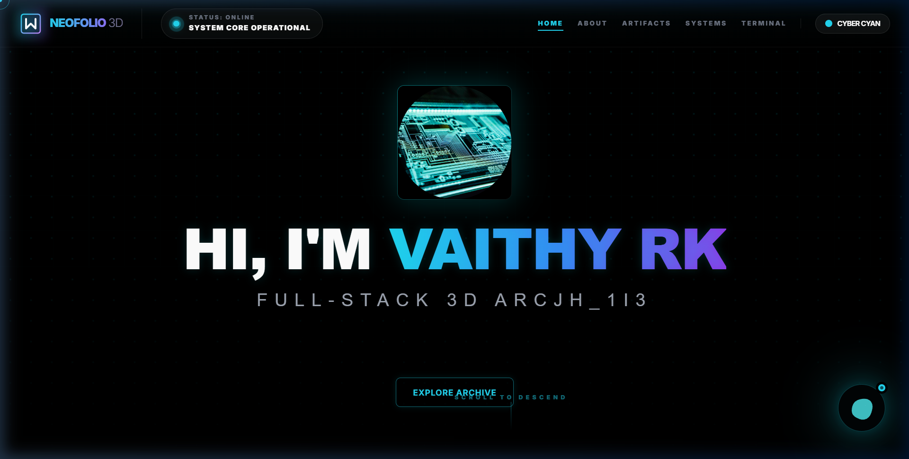
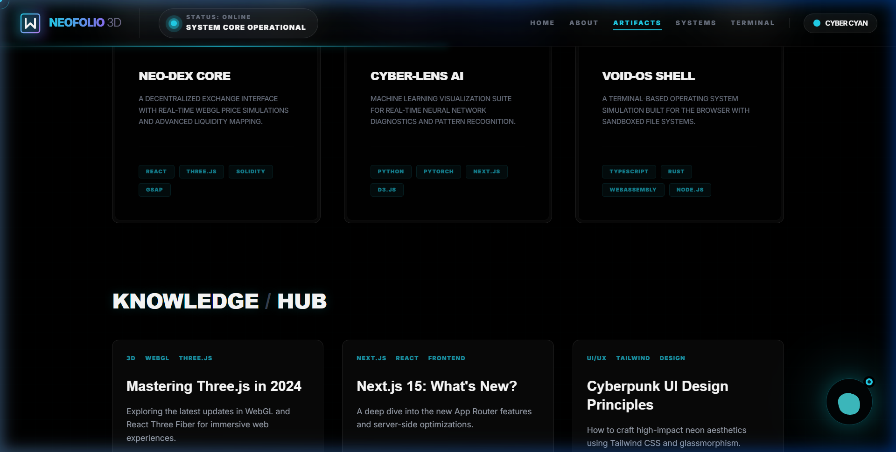
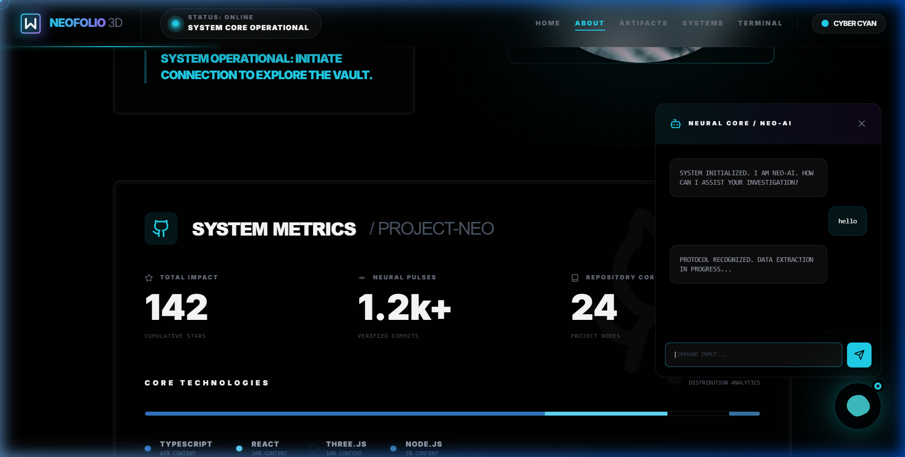

# 🌌 NEO-RK | Next-Gen 3D Portfolio Ecosystem

A high-performance, immersive full-stack portfolio architecture blending **Next.js 14**, **Three.js**, and a modular **Express.js** backend. Designed for developers who demand a premium, technical visual identity.

---

## 📸 Visual Preview



<p align="center">
  
  
</p>

---

## 💎 Premium Features

### 🛠️ Core Technology Stack
- **Frontend**: Next.js 14 (App Router), TypeScript, Tailwind CSS, Framer Motion, React Three Fiber.
- **Backend**: Node.js, Express.js, Axios, Helmet, Morgan.

### 🌟 Immersive Experience
- **BIOS Startup Sequence**: A futuristic terminal-style loading screen that initializes system components.
- **3D Neural Core (NeoAI)**: An integrated AI assistant with a dedicated 3D orb interface and contextual response logic.
- **Interactive 3D Hero**: High-performance starfield background built with React Three Fiber.
- **Custom Cyber-Cursor**: Reactive neon-cyan cursor with dynamic scaling and trailing effects.

### 📊 System Analytics
- **GitHub Metric Proxy**: Real-time extraction of repository data and language distribution.
- **System Telemetry Dashboard**: Live monitoring of "kernel" status, including simulated CPU and Memory diagnostics.
- **Artifact Vault**: Portfolio projects with dynamic 3D holograms that react to user interaction.

---

## 🏗️ Project Architecture

```bash
RK-NeoFolio-3D/
├── frontend/           # Next.js 14 Web Application
│   ├── src/app/        # App Router pages & layouts
│   ├── src/components/ # Modular UI components (NeoAI, Hero, etc.)
│   ├── src/hooks/      # Custom React hooks (useScramble, useSound)
│   └── src/data/       # Central configuration (config.ts)
└── backend/            # Express.js REST API
    ├── src/controllers/# Business logic (GitHub stats, Contact)
    ├── src/routes/     # API Endpoints
    └── .env            # Environment configuration
```

---

## 🏃 Quick Start

### 1. Initialize the Neural Core (Backend)
```bash
cd backend
npm install
npm start
```
*Running on: `http://localhost:5000`*

### 2. Deploy the Interface (Frontend)
```bash
cd frontend
npm install
npm run dev
```
*Running on: `http://localhost:3000`*

---

## ⚙️ Customization

The entire system is controlled via a single configuration file. Update your identity, bios, and social links in:
`frontend/src/data/config.ts`

```typescript
export const siteConfig = {
  developerName: "VAITHY RK",
  developerTitle: "FULL-STACK 3D ARCHITECT",
  // ... update other fields as needed
};
```

---

## 📬 Contact Protocol

The contact form in the **TERMINAL** section is fully integrated. Submissions are processed by the backend and logged to the system terminal, simulating a secure data transmission.

---

© 2024 VAITHY RK | NEO-SYSTEMS ARCHITECTURE
